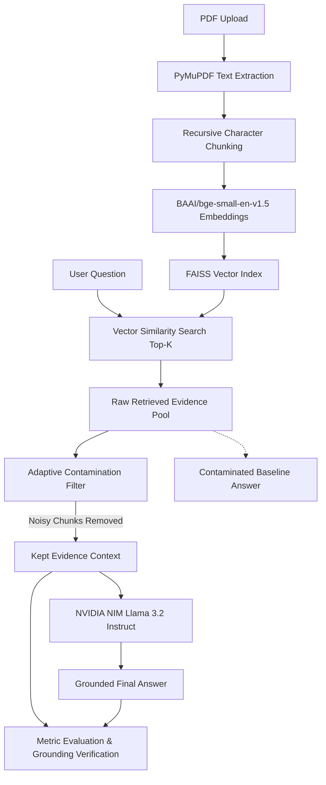

# 📚 PDF RAG Intelligence System: Reducing Context Contamination in LLM Retrieval

An advanced Retrieval-Augmented Generation (RAG) system engineered to mitigate **context contamination**, prevent hallucinations, and optimize evidence-grounded answers across diverse document domains including **General QA**, **Medical Reports**, and **Legal Case Studies**.

Powered by **FAISS**, **BGE Embeddings**, **LangChain**, and **NVIDIA NIM** (Llama 3.2).

---

## 🌟 Key Features

- **Adaptive Context Contamination Filtering**:
  Intelligently filters out noisy, weak, and redundant chunks from retrieval pools using semantic relevance thresholds and lexical protection—preventing distraction and hallucination in LLM answers.
- **Multi-Domain Intelligence**:
  Unified architecture with specialized post-processing and formatting for:
  - 📄 **General PDF QA**: Technical whitepapers, research articles, manuals, resumes.
  - 🩺 **Medical Report Analysis**: Clinical findings, diagnostic summaries, and medical disclaimers.
  - ⚖️ **Legal Court Case Analysis**: Case ratio decidendi, statutory citations, and legal holdings.
- **Comprehensive Evaluation Benchmark**:
  Real-time before/after filtering metrics comparing:
  - **Contamination Reduction Rate (%)**
  - **Semantic Overlap & Accuracy** (Precision, Recall, F1)
  - **Generation Metrics**: BLEU score & ROUGE (ROUGE-1, ROUGE-2, ROUGE-L)
  - **Perplexity Scoring** via Causal LM
- **⚡ Fast Mode**:
  Streamlined execution path completing retrieval, adaptive filtering, generation, and verification in **5–8 seconds**.
- **Dual User Interface**:
  - 🖥️ **Streamlit Web UI**: Interactive dashboard with contamination visualizer and metrics tables.
  - 💻 **Terminal CLI Mode**: Headless command-line interface with interactive PDF switching.

---

## 🏗️ System Architecture



---

## 🚀 Quick Start Guide

### Prerequisites
- Python 3.10+ (macOS, Linux, or Windows)
- An NVIDIA NIM API key (get one free at [NVIDIA API Catalog](https://build.nvidia.com/explore/discover))

### 1. Clone the Repository
```bash
git clone https://github.com/Varun-0731/Reducing-contest-contamination-llm.git
cd Reducing-contest-contamination-llm
```

### 2. Set Up Virtual Environment
```bash
python3 -m venv .venv
source .venv/bin/activate    # On Windows: .venv\Scripts\activate
```

### 3. Install Dependencies
```bash
pip install --upgrade pip
pip install -r requirements.txt
```

### 4. Configure Environment Variables
Copy the example `.env.example` file to `.env`:
```bash
cp .env.example .env
```
Edit `.env` and insert your NVIDIA API key:
```env
NVIDIA_API_KEY=nvapi-your_api_key_here
NVIDIA_MODEL=meta/llama-3.2-11b-vision-instruct
FAST_MODE=true
```

---

## 💻 Running the Application

### Option A: Streamlit Web UI (Recommended)
Launch the interactive web application:
```bash
streamlit run app.py
```
Open **[http://localhost:8501](http://localhost:8501)** in your browser.
1. Select a **Case Study** (General, Medical, or Legal) from the sidebar.
2. Upload any PDF file.
3. Ask questions and inspect the **Retrieval Analysis** and **Contamination Analysis** tabs to observe filtered noise reduction in real time.

### Option B: Interactive Terminal CLI
Run in terminal mode:
```bash
python retrieval/retrieval_pipeline.py
```
- Available commands during the session:
  - `pdf`: Select a new case study and import a different PDF.
  - `metrics`: View cumulative evaluation scores across answered questions.
  - `rebuild`: Re-evaluate and update all metrics in `evaluation.csv`.
  - `exit`: Quit the terminal session.

---

## 📁 Project Structure

```text
Reducing-contest-contamination-llm/
├── app.py                         # Streamlit Web Application & Dashboard
├── requirements.txt               # Direct package dependencies
├── .env.example                   # Environment configuration template
├── .gitignore                     # Git ignore rules (secrets & temp data protected)
├── evaluation.csv                 # Persistent evaluation metrics log
├── data/
│   └── pdfs/                      # Sample benchmark PDFs
├── ingestion/
│   ├── chunker.py                 # PDF parsing & text chunking utilities
│   └── pdf_ingestion.py           # Document loader pipeline
├── retrieval/
│   └── retrieval_pipeline.py      # Core RAG, FAISS search, filtering & NIM client
├── medical/
│   └── medical_analysis.py        # Clinical report formatting layer
└── legal/
    └── legal_analysis.py          # Legal case analysis formatting layer
```

---

## 📊 Evaluation & Metrics

The system records every evaluation into `evaluation.csv` for reproducibility:

| Metric | Purpose |
| :--- | :--- |
| **Contamination Reduction** | Percentage of noisy/redundant retrieved chunks pruned. |
| **Semantic Accuracy** | Cosine similarity between reference answers and model output using BGE embeddings. |
| **Precision / Recall / F1** | Token-overlap measures against the evidence baseline. |
| **BLEU & ROUGE** | Standard n-gram overlap benchmarks (ROUGE-1, ROUGE-2, ROUGE-L). |
| **Perplexity** | Causal language model fluency metric. |

---

## 🤝 Contributing

Contributions, issues, and feature requests are welcome!

1. Fork the Project
2. Create your Feature Branch (`git checkout -b feature/AmazingFeature`)
3. Commit your Changes (`git commit -m 'Add some AmazingFeature'`)
4. Push to the Branch (`git push origin feature/AmazingFeature`)
5. Open a Pull Request

---

## 📜 License

Distributed under the MIT License. See `LICENSE` for more information.
